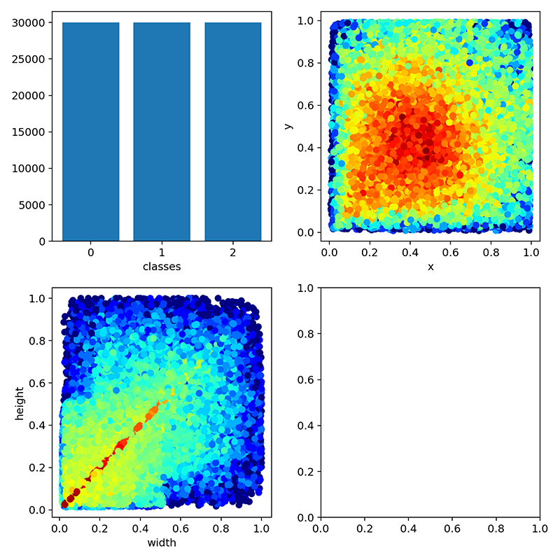

## About

Retrained YOLOv5 model for solving problem #28:

`http://www.microcontest.com/contest.php?id=28&lang=en`

See `./train.ipynb` for details.


## Training

- Epochs: `100`
- Batch size: `64`
- Base model: [YOLOv5s](https://github.com/ultralytics/yolov5)
- Hardware: `Tesla P100/16GB in a Google Colab instance`


## Labels

```text
0: circle
1: triangle
2: rectangle
```


## Datasets

### Training

- Total images: `10000`
- Image dimensions: `416 px²`
- Type: `randomly generated`
- Min shapes (per label) in image: `1`
- Max shapes (per label) in image: `5`
- Samples per shape combination: `80`

### Validation

- Total images: `2000`
- Image dimensions: `416 px²`
- Type: `randomly generated`
- Min shapes (per label) in image: `1`
- Max shapes (per label) in image: `5`
- Samples per shape combination: `16`


## Label Statistics

<p></p>


## Model Performance

<p></p>


## Inference Sample

<p></p>

```text
1 0.648087 0.218391 0.0648918 0.254789
1 0.264559 0.49569 0.359401 0.794061
0 0.604825 0.569444 0.0715474 0.0431034
2 0.312812 0.821839 0.559068 0.0708812
1 0.424293 0.36159 0.58569 0.495211
0 0.524958 0.657088 0.950083 0.636015
2 0.932612 0.474617 0.12812 0.299808
0 0.724626 0.141762 0.544093 0.277778
0 0.178037 0.808429 0.329451 0.193487
```
