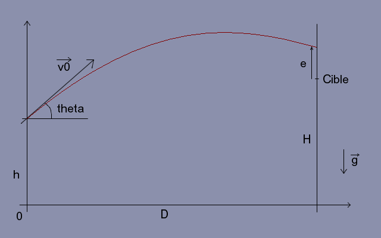

# Ballistic

**Physics – Problem #8**

`http://www.microcontest.com/contest.php?id=8&lang=en`

## Description

The goal of this challenge is to anticipate the trajectory of a missile.

Here is the situation:

The different data of the problem are given to you in the corresponding
variables.

You will take `g = 9.81 m/sec²` for the acceleration due to gravity.

The missile is considered as punctual and we ignore the friction.

## I/O

### Inputs

| Variable Name | Type    | C Type | Description                                                     |
| ------------- | ------- | ------ | --------------------------------------------------------------- |
| **h**         | Integer | int    | Shot height relative to the ground, in m                        |
| **H**         | Integer | int    | Height of the center of the target relative to the ground, in m |
| **D**         | Integer | int    | Distance from the wall to the shooting range, in m              |
| **v0**        | Integer | int    | The projectile velocity, in m/s                                 |
| **theta**     | Real    | float  | The shooting angle, in radians                                  |

### Outputs

| Variable Name | Type | C Type | Description                                                                                                   |
| ------------- | ---- | ------ | ------------------------------------------------------------------------------------------------------------- |
| **e**         | Real | float  | Algebraic distance to the center of the target (too high: `e > 0`, too low: `e < 0`), with 0.1 m of tolerance |
| **duree**     | Real | float  | The flight time in sec, with 0.1 sec of tolerance                                                             |
