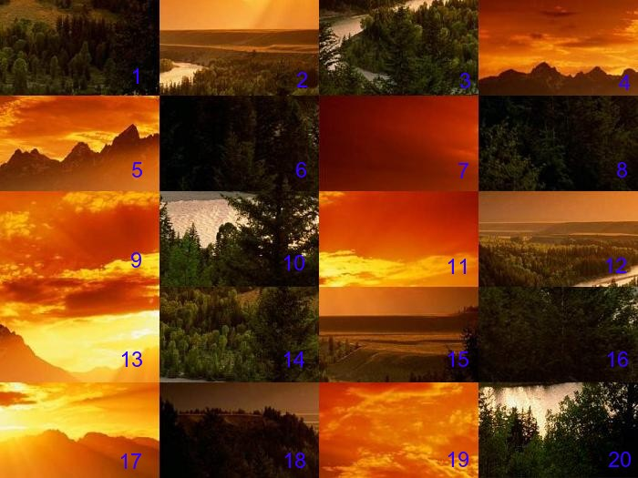
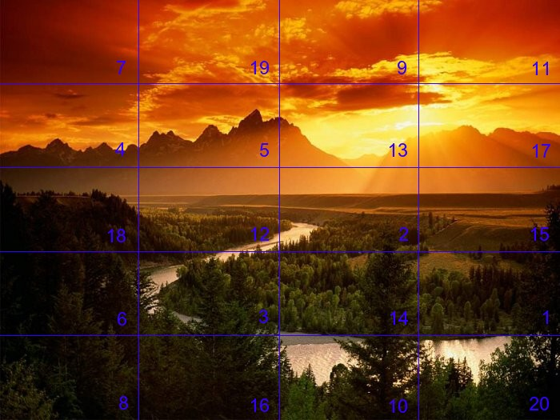

# Puzzle

**Multimedia – Problem #9**

`http://www.microcontest.com/contest.php?id=9&lang=en`


## Description

The objective of this test is to reconstruct an image from its mixed pieces.

The principle is simple: The original image is split into a variable number of
rectangles; the number of columns given by the variable `nb_colonnes` and the
number of rows by `nb_lignes`.

These rectangular pieces are then mixed, so as to obtain an image of the same
dimension. You must number these pieces from `1` to `n` on the image that you
are going to download, with `n` the total number of pieces
(`n = nb_lignes * nb_colonnes`), incrementing from left to right and from top
to bottom as in the following example:



Here:

```text
nb_colonnes = 4
nb_lignes   = 5
```

Your objective is to replace the previously numbered pieces in their original
place to reconstruct the image. In our example, you should get this:



The numbers are here for illustrative purposes, you must of course manage them
differently than by writing them on the images.

You just have to build a character string (`char*`), in which you write the
numbers separated by commas in this order: the first number is the number of the
pieces at the top left, the second the number from its neighbor on the right,
etc., and return it within the `resultat` variable.

Here, the string would be:

```text
7,19,9,11,4,5,13,17,18,12,2,15,6,3,14,1,8,16,10,20
```


## I/O

### Inputs

| Variable Name   | Type    | C Type | Description                                                                                                                                                                                         |
| --------------- | ------- | ------ | --------------------------------------------------------------------------------------------------------------------------------------------------------------------------------------------------- |
| **img**         | String  | char*  | PNG image of the puzzle, with the same size of the original but with the pieces mixed. Be careful: this buffer may contain null characters, use the provided length instead of the function strlen. |
| **nb_lignes**   | Integer | int    | Number of rows of the cutting                                                                                                                                                                       |
| **nb_colonnes** | Integer | int    | Number of columns of the cutting                                                                                                                                                                    |

### Outputs

| Variable Name | Type   | C Type | Description                                                                               |
| ------------- | ------ | ------ | ----------------------------------------------------------------------------------------- |
| **resultat**  | String | char*  | String containing the number of the pieces with the correct order as described previously |
