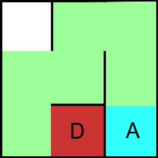

# Maze

**AI – Problem #17**

`http://www.microcontest.com/contest.php?id=17&lang=en`


## Description

The purpose of this test is to find the path that connects the entry box to the
arrival box.

To do this, you must retrieve 7 variables:

- The labyrinth proper (`laby`)
- The number of columns in the labyrinth (`nb_colonnes`)
- The number of lines in the labyrinth (`nb_lignes`)
- The column of the starting box (`departure_column`)
- The line of the starting square (`ligne_depart`)
- The column of the arrival box (`colonne_arrivee`)
- The finish box line (`ligne_arrivee`)

As for the labyrinth, it is coded in the form of a character string. For each
box, there are four letters indicating whether the walls `North`, `West`,
`South` and `East` of it are opened or closed (`O` and `F`, respectively).

For example, this labyrinth:



The entry, marked in red, is at coordinates `(2, 3)` and the exit, in cyan, at
`(3, 3)`.

The `laby` variable would then contain:

```text
"FFOF-FFOO-FOOF-OFOO-OOFF-OFOF-OFFO-FOFF-OFFF"
```

You have to find a path in the maze to get from the entrance to the exit. To
return this path, you must build a character string composed of the characters
`G`, `D`, `B`, `H`, for `Left`, `Right`, `Down`, `Up`, which corresponds to the
calculated path.

In our case, we would have to return in the chemin variable:

```text
"GHDHDBB"
```

Finally, you don't necessarily have to return the shortest path ;)


## I/O

### Inputs

| Variable Name       | Type    | C Type | Description                                                   |
| ------------------- | ------- | ------ | ------------------------------------------------------------- |
| **laby**            | String  | char*  | Maze, formatted as explained in description                   |
| **nb_colonnes**     | Integer | int    | Number of columns of the maze                                 |
| **nb_lignes**       | Integer | int    | Number of lines of the maze                                   |
| **colonne_depart**  | Integer | int    | Number (starting with 1) of the column of the starting square |
| **ligne_depart**    | Integer | int    | Number (starting with 1) of the row of the starting square    |
| **colonne_arrivee** | Integer | int    | Number (starting with 1) of the column of the arrival square  |
| **ligne_arrivee**   | Integer | int    | Number (starting with 1) of the row of the arrival square     |

### Outputs

| Variable Name | Type   | C Type | Description                                 |
| ------------- | ------ | ------ | ------------------------------------------- |
| **chemin**    | String | char*  | Path, formatted as described in description |
