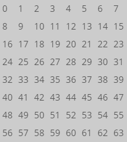
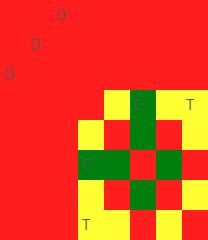

# Chess Game I

**AI – Problem #22**

`http://www.microcontest.com/contest.php?id=22&lang=en`


## Description

Your objective is to control all of the chessboard boxes with a limited number
of pieces. The variable pieces gives you a list of the pieces you have.

For example, it may contain `dttfcp`. In this case you have a queen, two rooks,
a bishop, a knight, and a pawn.

All the pieces move in the traditional way except the pawn which can move one
square according to the four diagonals.

You must therefore find a positioning such that all the squares are under
attack.

There is one variable per part to return: its name corresponds to its position
in the list. In the previous example, the queen is in first position, so the
variable will be called `1`. This contains the index of the box on which the
piece is located:



Let's take a concrete example. If variable pieces contains `dddttcc`, there are
three queens, two rooks, and two knights. Here is a possible solution:



The variables to return in this case would be:

```text
'1' = 2
'2' = 9
'3' = 16
'4' = 31
'5' = 59
'6' = 43
'7' = 29
```


## I/O

### Inputs

| Variable Name | Type   | C Type | Description                    |
| ------------- | ------ | ------ | ------------------------------ |
| **pieces**    | String | char*  | List of available chess pieces |

### Outputs

| Variable Name | Type    | C Type | Description                                       |
| ------------- | ------- | ------ | ------------------------------------------------- |
| **1**         | Integer | int    | Index of the square where the first piece stands  |
| **2**         | Integer | int    | Index of the square where the second piece stands |
| **N...**      | Integer | int    | Index of the square where the Nth piece stands    |
