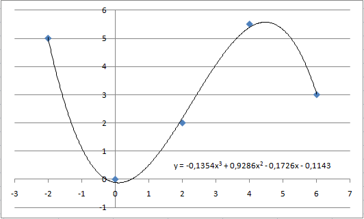

# Polynomial Regression

**Mathematics – Problem #25**

`http://www.microcontest.com/contest.php?id=25&lang=en`

## Description

In this test, the goal is to approach a set of points on the plane (a series of
measurements for example), by a polynomial curve.

Several points are therefore given to you (their number, which varies, is given
to you in `nb_points`). Your role is to find a polynomial that approaches each
given point to the nearest `0.05` (in terms of ordinate). You are free to choose
the degree of the polynomial, as long as you respect the required precision.

Here is an example:

The points provided are in this case: `(-2;5), (0;0), (2;2), (4;5.5), (6;3)`.

The polynomial of degree 3 calculated on this example obviously does not provide
a sufficient approximation, it is thus necessary to seek a polynomial of higher
degree.

The coordinates of the points are given to you in the variables
<code>xi</code> and <code>yi</code>, where `i` is the
index of the point. So, if there are three points, you have to get
<code>x0</code>, <code>y0</code>,
<code>x1</code>, <code>y1</code>,
<code>x2</code>, and <code>y2</code>.

Concerning your answer, you must return on the one hand the degree of your
polynomial in the variable `degre`, then each coefficient in the variables `ai`,
where `i` is the number of the coefficient, starting from `0` for the constant.

For example, if your polynomial is of degree 2, according to the notations it is
written like this: `y = a2*x² + a1*x + a0`. You must then return the
coefficients in the variables `a0`, `a1`, and `a2`. You should therefore not
return the same number of variables for each test, depending on the data.

## I/O

### Inputs

| Variable Name | Type    | C Type | Description             |
| ------------- | ------- | ------ | ----------------------- |
| **nb_points** | Integer | int    | Number of points        |
| **xi**        | Integer | int    | x-coordinate of point i |
| **yi**        | Integer | int    | y-coordinate of point i |

### Outputs

| Variable Name | Type    | C Type | Description                                                     |
| ------------- | ------- | ------ | --------------------------------------------------------------- |
| **degre**     | Integer | int    | Order of your polynomial                                        |
| **ai**        | Real    | float  | Coefficient number i, in the order explained in the description |
