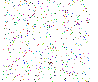
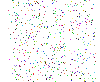

# Optical Character Recognition II

**AI – Problem #26**

`http://www.microcontest.com/contest.php?id=26&lang=en`

## Description

As well as the Optical Character Recognition I contest, the principle of this
challenge is to recognize a word within a picture.

The difference is that we don't give you the image as it should be to see the
word properly. Indeed, one consider a cube containing a color pixels cloud that
has a particular disposition. If you watch the front view of the cube or one of
the side views, you will only see the points cloud. However, you will be able to
observe a text on the top view. You will have to rebuild this face from the
front view and the left view.

Here is an example:

| View  | Image                                    |
| :---: | :--------------------------------------: |
| Top   |  |
| Front |  |
| Left  |  |

You can see the top view, the front view and the left view respectively.

Both images that are on the right are given in the variables `face` and
`gauche`. Then, you have to determine the text written on the top view and send
it back in the variable `text`.

Be aware that the text can have any orientation.

## I/O

### Inputs

| Variable Name | Type   | C Type | Description                                |
| ------------- | ------ | ------ | ------------------------------------------ |
| **face**      | String | char*  | Image corresponding to the front view, png |
| **gauche**    | String | char*  | Image corresponding to the left view, png  |

### Outputs

| Variable Name | Type   | C Type | Description                   |
| ------------- | ------ | ------ | ----------------------------- |
| **text**      | String | char*  | Text readable in the top view |
