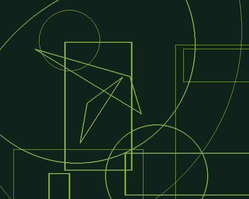

# Forms Analysis

**Multimedia – Problem #28**

`http://www.microcontest.com/contest.php?id=28&lang=en`

## Description

The objective of this challenge is to analyze an image so you can count the
different items of which it is composed.

The two images you are going to get are composed of circles, rectangles and
triangles. The background is plain and the drawings have the same color. Here is
an example of an image you can obtain:

In this example, there are six rectangles, two triangles, and six circles.

You must do this work on two PNG images, that you get in the variables `img1`
and `img2`.

You must send back the number of rectangles in image 1 in `nb_rectangles_1`, the
number of triangles in this image in `nb_triangles_1` and the number of circle
in `nb_cercles_1`. The principle is the same for image 2.

## I/O

### Inputs

| Variable Name | Type   | C Type | Description            |
| ------------- | ------ | ------ | ---------------------- |
| **img1**      | String | char*  | Image 1, in PNG format |
| **img2**      | String | char*  | Image 2, in PNG format |

### Outputs

| Variable Name       | Type    | C Type | Description                         |
| ------------------- | ------- | ------ | ----------------------------------- |
| **nb_rectangles_1** | Integer | int    | The number of rectangles in Image 1 |
| **nb_triangles_1**  | Integer | int    | The number of triangles in Image 1  |
| **nb_cercles_1**    | Integer | int    | The number of circles in Image 1    |
| **nb_rectangles_2** | Integer | int    | The number of rectangles in Image 2 |
| **nb_triangles_2**  | Integer | int    | The number of triangles in Image 2  |
| **nb_cercles_2**    | Integer | int    | The number of circles in Image 2    |
