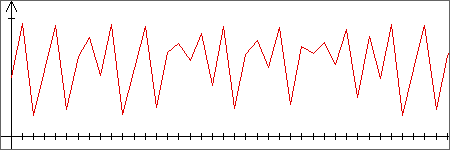
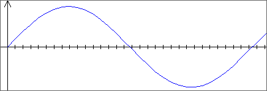
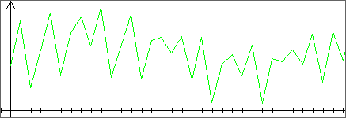
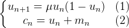

# Chaotic Cryptography I

**Cryptography – Problem #29**

`http://www.microcontest.com/contest.php?id=29&lang=en`


## Description

This test deals with chaotic cryptography through the use of a simple
cryptosystem. The principle consists in the generation of a chaotic signal
(having the appearance of noise) to which we add the clear message. Here is an
example:



<p></p>



<p></p>



The red chaotic signal is added to the blue signal that one wishes to encrypt to
give the green encrypted signal.

The objective is to decipher a signal coded with this cryptosystem:



The sequence ***(u<sub>n</sub>)<sub>n</sub>*** is the recurring logistic
sequence and describes the chaotic signal. The sequence
***(c<sub>n</sub>)<sub>n</sub>*** is the encrypted message which is therefore
the sum of the chaotic signal with the clear signal ***m<sub>n</sub>***. The
parameter ***μ*** and the initial term ***u<sub>0</sub>*** therefore represent
the secret key. Above, ***(u<sub>n</sub>)<sub>n</sub>*** is in red,
***(m<sub>n</sub>)<sub>n</sub>*** is in blue and
***(c<sub>n</sub>)<sub>n</sub>*** is in green.

In order to decipher the message, you have the number sequence
(***c<sub>n</sub>***) and the first two clear terms ***m<sub>0</sub>*** and
***m<sub>1</sub>***.

The terms of the clear message are real numbers between `0` and `1`. Once
deciphered, the message must be converted into a string of `0` and `1` as
follows:

- All terms in `[0, 0.5]` will be transformed into `0`
- All terms in `(0.5, 1]` will be transformed into `1`

Here is an example:

Format of the encrypted message:

```text
0.7;1.6675;0.6216873125;1.213623706;1.038626455
```

Clear message decrypted:

```text
0.2; 0.7; 0.5; 0.8; 0.1 0.2; 0.7; 0.5; 0.8; 0.1
```

Corresponding result:

```text
01010
```

The string thus formed must be returned in the `message_clair` variable.


## I/O

### Inputs

| Variable Name       | Type   | C Type | Description                   |
| ------------------- | ------ | ------ | ----------------------------- |
| **message_chiffre** | String | char*  | Cypher to decrypt             |
| **m0**              | Real   | float  | First term of the plain text  |
| **m1**              | Real   | float  | Second term of the plain text |

### Outputs

| Variable Name     | Type   | C Type | Description       |
| ----------------- | ------ | ------ | ----------------- |
| **message_clair** | String | char*  | Decrypted message |
