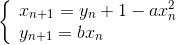

# Chaotic Cryptography II

**Cryptography – Problem #32**

`http://www.microcontest.com/contest.php?id=32&lang=en`


## Description

Let's make the Chaotic Cryptography I
(`http://www.microcontest.com/contest.php?id=29`) test a bit more complex.

Here we are going to modify the way of coding the information, but always based
on a chaotic sequence. We will consider the Hénon sequence:



It will be ***(x<sub>n</sub>)<sub>n</sub>*** which will act as a chaotic sequence.

The clear message will consist of only three characters: `0`, `1` and `2`
(although this system works with any number of characters).

The idea is to create as many chaotic suites; in our case we will therefore have
three sequences each characterized by parameters ***a***, ***b*** and different
initial terms ***x<sub>0</sub>*** and ***y<sub>0</sub>***.

The encryption then takes place as follows: each character is coded by the value
of the term of the same rank in the associated chaotic sequence. Each chaotic
sequence being associated with a character.

Let's take an example:

| Chaotic Suite                       | Values             |
| :---------------------------------: | ------------------ |
| ***(x<sub>n</sub>)<sub>n</sub> 0*** | `1 ; 2 ; 3 ; 4`    |
| ***(x<sub>n</sub>)<sub>n</sub> 1*** | `5 ; 6 ; 7 ; 8`    |
| ***(x<sub>n</sub>)<sub>n</sub> 2*** | `9 ; 10 ; 11 ; 12` |

| Message Type | Message Payload   |
| ------------ | ----------------- |
| Cleartext    | `1220`            |
| Encrypted    | `5 ; 10 ; 11 ; 4` |

You must therefore decrypt the message provided in the `message_chiffre`
variable in the following format:

```text
0.2214556;1.0155;0.289621;...
```

You also have a machine that encrypts according to the parameters assigned to
your test. However, it does not allow coding of messages longer than five
characters.

You can access it at the following address:

```text
http://www.microcontest.com/contests/32/crypt.php?m=02102&PHPSESSID=variable_phpsessid
```

`m` is the clear message that will be encrypted and returned by the web page.

For the machine to work, you must replace `variable_phpsessid` with the content
of the variable `phpsessid`. You have two additional seconds in order to have
time to make the requests; a total of six seconds. You must return the decrypted
message as a string (therefore composed of `0`, `1` and `2`) in the
`message_clair` variable.


## I/O

### Inputs

| Variable Name       | Type   | C Type | Description                       |
| ------------------- | ------ | ------ | --------------------------------- |
| **message_chiffre** | String | char*  | Encrypted message                 |
| **phpsessid**       | String | char*  | Session id to pass to `crypt.php` |

### Outputs

| Variable Name     | Type   | C Type | Description       |
| ----------------- | ------ | ------ | ----------------- |
| **message_clair** | String | char*  | Decrypted message |
