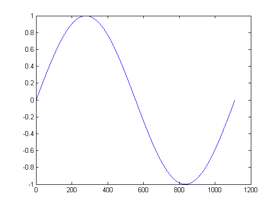
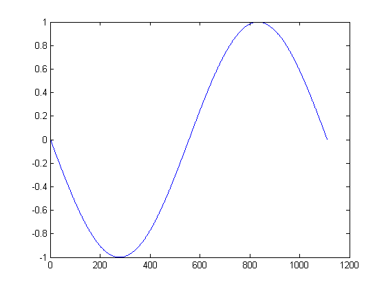
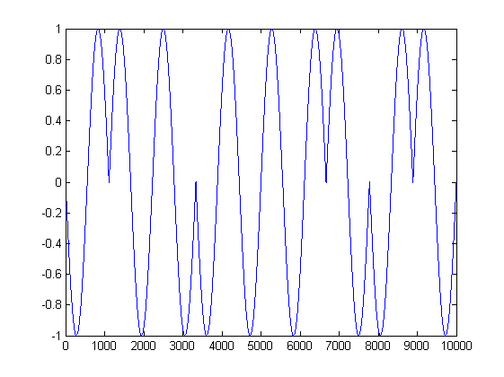
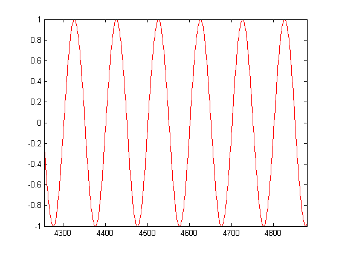

# Transmission of a Digital Signal

**Multimedia – Problem #33**

`http://www.microcontest.com/contest.php?id=33&lang=en`

## Description

This test tackles the problem of the transmission of a digital signal thanks to
an analog signal.

First take the binary sequence that we want to transmit: `011000101`.

The first step consists for example in associating an analog signal with each
bit.

Many possibilities exist, one of the best known and simplest is to associate a
state `0` with bit `0`, and a constant with bit `1`. One thus obtains slots
(coding NRZ-L unipolar).

But it wouldn't be funny if it was that simple, that's why we're going to use
the following coding:

- Bit `1` corresponds to a sinusoid period of zero phase.
- Bit `0` corresponds to a phase sinusoid period Pi.

This means that `1` corresponds to this:

And `0` corresponds to:

That said, we can now represent our digital sequence by an analog signal:

We could send this analog signal directly to transmit the information. But to
complicate a little, we will modulate this signal in amplitude with a sinusoidal
carrier.

Amplitude modulation simply consists of multiplying a carrier and the useful
signal. The useful signal is represented on the graph below, the carrier then
has this appearance:

The product of these two signals gives the signal that we will actually transmit
(and that you must demodulate and decode!) as follows:

So we put ourselves in the role of the receiver, which receives this signal. To
analyze it, he samples it. The sampled signal is then found in the `signal_recu`
variable, in WAV format.

You must return the binary sequence in the result variable as a character string
`0` and `1`. Here you should return `011000101`.

As we are nice, the frequency of the carrier is provided in the variable
`freq_porteuse`.

It's your turn!

## I/O

### Inputs

| Variable Name     | Type    | C Type | Description                                                                                                                                                                                                            |
| ----------------- | ------- | ------ | ---------------------------------------------------------------------------------------------------------------------------------------------------------------------------------------------------------------------- |
| **signal_recu**   | String  | char*  | The signal received in wav format. You must demodulate it and decode the binary sequence it represents. Warning: This buffer can contain '\0', use the length provided by the library rather than the strlen function. |
| **freq_porteuse** | Integer | int    | Carrier frequency, in Hz.                                                                                                                                                                                              |

### Outputs

| Variable Name | Type   | C Type | Description                                                      |
| ------------- | ------ | ------ | ---------------------------------------------------------------- |
| **resultat**  | String | char*  | The decoded binary sequence, composed of characters '0' and '1'. |
