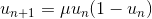
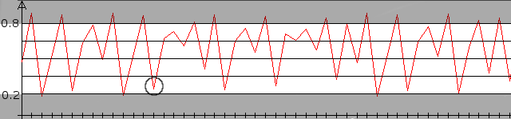

# Chaotic Cryptography III

**Cryptography – Problem #35**

`http://www.microcontest.com/contest.php?id=35&lang=en`


## Description

We are now going to work on a way more robust cryptosystem than the previous one
(`http://www.microcontest.com/contest.php?id=32`). It has recently been proposed
by M.S. Baptista. Here is how it works:

We still consider a chaotic sequence; let's take the Logistic Sequence:



All the values of this sequence are between `0` and `1`. We will consider a
sub-interval: `I = [0.2, 0.8]`, in which we are going to work. The plain text
messages will be composed of four characters: `0`, `1`, `2` and `3`, to which
we will associate a quarter of our interval `I` (there are as many parts as
characters):



The first interval `[0.2, 0.35)` is associated to the character `0`, the
interval `[0.35, 0.5)` to `1`, and so on. The encoding works that way:

- We consider the first character to encode.
- We iterate the chaotic sequence a fixed number of times ***N<sub>0</sub>***
  that we will fix to `5`.
- We keep iterating the sequence until, after a number ***n*** >
  ***N<sub>0</sub>*** (***N<sub>0</sub>*** is counted in ***n***) of iterations,
  ***u<sub>n</sub>*** is contained in the interval associated to the character.
  This number of iterations ***n*** is the encoded character.
- We iterate this process for every character of the plain text, taking
  ***u<sub>n</sub>*** as first value of the chaotic sequence (therefore, we
  generate a different chaotic sequence for every character).

The encoded message will be a sequence of integers, obtained as previously
explained.

Let's take an example. If the first character is `0`, with the sequence above,
we have to iterate *13 times* to obtain a value in the first interval (encircled
item). The first value of the encoded message will be `13`.


The challenge consists in decoding a message given in the variable
`message_chiffre` with the following formatting:

```text
24;12;8;74;...
```

and sending back the result in the variable `message_clair`, composed by the
string formed by the characters `0`, `1`, `2` and `3`. For example:

```text
11121301
```


For this, you have at your disposal, like for the challenge Chaotic Cryptography
II (`http://www.microcontest.com/contest.php?id=32`), a machine allowing you to
encode any string you want with the parameters generated for your attempt. This
page is available here:

```text
http://www.microcontest.com/contests/35/crypt.php?m[]=2301023&m[]=221013022
```

You can encode up to five messages at once, in order to limit the number of
requests, with the following syntax:

```text
m[]=message1&m[]=message2&...&PHPSESSID=variable_phpsessid
```

To have the machine working, you have to replace `variable_phpsessid` with the
content of the variable `phpsessid`. You will get the coded messages, each one
of them on a new line, in the order of the request.


## I/O

### Inputs

| Variable Name       | Type   | C Type | Description                       |
| ------------------- | ------ | ------ | --------------------------------- |
| **message_chiffre** | String | char*  | Cipher                            |
| **phpsessid**       | String | char*  | Session id to send to `crypt.php` |

### Outputs

| Variable Name     | Type   | C Type | Description     |
| ----------------- | ------ | ------ | --------------- |
| **message_clair** | String | char*  | Decoded message |
