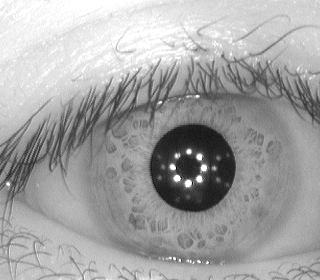

# Person Identification - Iris

**AI – Problem #36**

`http://www.microcontest.com/contest.php?id=36&lang=en`


## Description

It is required to be able to solve the challenge base64
(`http://www.microcontest.com/contest.php?id=50`) in order to get the images of
this challenge.

This challenge, worthy of a proper american action movie, makes you handle the
role of a police engineer, responsible for the conception of a program capable
of identifying criminals from a picture of their iris, via a database.

You can download this database [here](extra/db.zip).

It contains four pictures of the right and left iris of 116 persons (two per
iris).

So, it contains `2*2*116 = 464` pictures of resolution `320*280`. The path of
these pictures is built this way:

```text
database_iris/xxx/y/xxxyzz.jpg
```

Where:

- `xxx` is the number of the individual (example `012`).
- `y` is a letter, `L` for the left eye, `R` for the right eye.
- `zz` is the number of the image.

For example, the second picture of the right eye of the eighteenth individual is
located at:

```text
database_iris/018/R/018R02.jpg
```



Three images will be given to you in `img1_b64`, `img2_b64` and `img3_b64`. They
can randomly concern the left or right eye of 3 individuals (not necessarily
different). You have to identify them. You will send back the individuals
numbers in the variables `id1`, `id2` and `id3`.

You have 10 seconds for this challenge.

Good luck!


## I/O

### Inputs

| Variable Name | Type   | C Type | Description                                                                          |
| ------------- | ------ | ------ | ------------------------------------------------------------------------------------ |
| **img1_b64**  | String | char*  | The picture of the iris of the first individual to identify, in JPG, base64 encoded  |
| **img2_b64**  | String | char*  | The picture of the iris of the second individual to identify, in JPG, base64 encoded |
| **img3_b64**  | String | char*  | The picture of the iris of the third individual to identify, in JPG, base64 encoded  |

### Outputs

| Variable Name | Type    | C Type | Description                         |
| ------------- | ------- | ------ | ----------------------------------- |
| **id1**       | Integer | int    | The number of the first individual  |
| **id2**       | Integer | int    | The number of the second individual |
| **id3**       | Integer | int    | The number of the third individual  |
