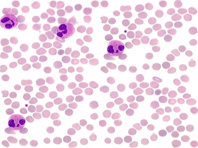

# Blood Image Analysis

**Multimedia – Problem #38**

`http://www.microcontest.com/contest.php?id=38&lang=en`


## Description

In the medical field, doctors need often a computerized assistance, to perform
repetitive tasks or to get help in their decisions.

In this challenge, you get an image representing a blood stream. On it, you can
see red (small ones) and white (big ones) blood cells. Your role is to count
them and send the results respectively in `nb_redbloodcells` and
`nb_whitebloodcells`.

For example, if you get this image:



You have to return :

```text
nb_redbloodcells   = 240
nb_whitebloodcells = 4
```


## I/O

### Inputs

| Variable Name | Type   | C Type | Description                                                                                                                                              |
| ------------- | ------ | ------ | -------------------------------------------------------------------------------------------------------------------------------------------------------- |
| **img**       | String | char*  | The PNG image representing the blood cells. Be careful: this buffer may contain null characters, use the provided length instead of the function strlen. |

### Outputs

| Variable Name          | Type    | C Type | Description                                         |
| ---------------------- | ------- | ------ | --------------------------------------------------- |
| **nb_redbloodcells**   | Integer | int    | Number of red blood cells appearing in the image.   |
| **nb_whitebloodcells** | Integer | int    | Number of white blood cells appearing in the image. |
