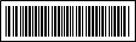

# Bar Code I

**Multimedia – Problem #39**

`http://www.microcontest.com/contest.php?id=39&lang=en`


## Description

This is the first challenge of a series about barcodes.

This one is simple, you have to decode a barcode encoded with the symbology
"Code 11".

You can find the specifications on this page:
`http://www.barcodeisland.com/code11.phtml`

**Important**: Our generator does NOT include the checksum digits (`C` and `K`)
since it is quite useless concerning the situation of the challenge.

The data encoded is composed of two numbers separated by a `-`.

You have to return the two numbers in `number1` and `number2`.

The PNG image is contained in the variable `img`.

Here is an example of a barcode you can get:



The data encoded here is `35185-22584`.

In this case you should return:

```text
number1 = 35185
number2 = 22584
```


## I/O

### Inputs

| Variable Name | Type   | C Type | Description                                                                                                                                            |
| ------------- | ------ | ------ | ------------------------------------------------------------------------------------------------------------------------------------------------------ |
| **img**       | String | char*  | The PNG image representing the bar code. Be careful: this buffer may contain null characters, use the provided length instead of the function strlen. |

### Outputs

| Variable Name | Type    | C Type | Description        |
| ------------- | ------- | ------ | ------------------ |
| **number1**   | Integer | int    | The first number.  |
| **number2**   | Integer | int    | The second number. |
