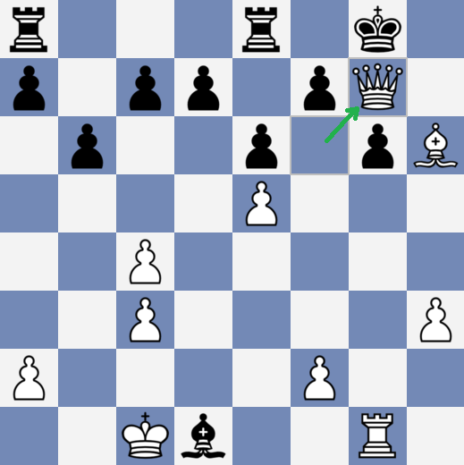

# Chess Game II

**AI – Problem #41**

`http://www.microcontest.com/contest.php?id=41&lang=en`


## Description

The goal of this challenge is double: You will master the PGN format, which is a
file format aimed at expressing the moves played during a chess game, and you
will need to be able to play a move (just the last one don't worry!).

You are the player with the white pieces.

You will get a chess game that has been already played and won, except that the
last move has been removed. It will be your role to determine it in order to
make a **checkmating move**.

The moves that have been already played are given to you in the variable `game`.
The format of this string is PGN, but we removed the header (you just get the
second part).

For example you can get:

```text
game = 1. c4 e6 2. Nf3 Nc6 3. d4 Nf6 4. Bg5 Be7 5. e3 Ng4 6. Bf4 O-O 7. h3 Bb4+ 8. Nc3 Nf6 9. Bd3 b6 10. e4 Bb7 11. e5 Nh5 12. Bxh7+ Kxh7 13. Ng5+ Kg8 14. Qxh5 Qxg5 15. Qxg5 Nxd4 16. O-O-O Bxc3 17. bxc3 Nf3 18. gxf3 Bxf3 19. Rhg1 g6 20. Qf6 Bxd1 21. Bh6 Rfe8
```

This means that after the 21 first moves of the game, the state is:


At this point, it's your turn to play, and in order to make a checkmating move,
you must play the move `Qg7#`, which gives this situation:



So in this case, you should return the solution string:

```text
last = Qg7#
```

The move must be expressed with the standards used in the PGN specifications
(be careful, the case is important).


## I/O

### Inputs

| Variable Name | Type   | C Type | Description                |
| ------------- | ------ | ------ | -------------------------- |
| **game**      | String | char*  | The game state, PGN format |

### Outputs

| Variable Name | Type   | C Type | Description                                     |
| ------------- | ------ | ------ | ----------------------------------------------- |
| **last**      | String | char*  | The last move the white player must play to win |
