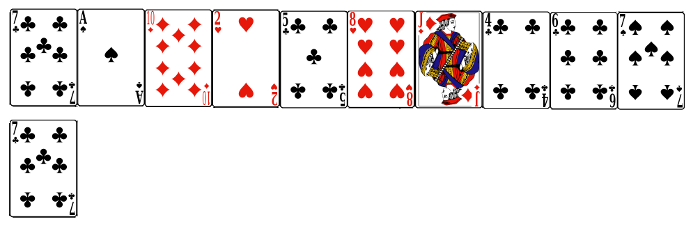
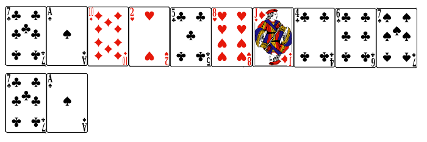
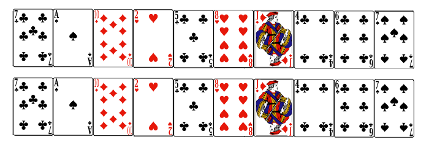
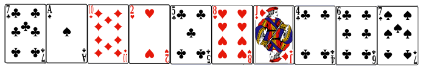

# Card Trick

**Miscellaneous – Problem #46**

`http://www.microcontest.com/contest.php?id=46&lang=en`


## Description

<small>Thanks to boris39 for this challenge!</small>

In this challenge, you will wear the magician's cloak. You will have to find the
initial sequence of cards, which leads to a final sequence proposed by your
audience.

**Steps of the trick**

You ask your audience to take `N` cards in a set of `52` cards. Example: your
audience takes `N = 10` cards.

You ask your audience to put these cards face up. Example: your audience puts in
front of you `10` cards, as follows:


You also ask your audience to write a list of `N-2` numbers on a paper, each
number could be `1`, `2` or `3`. Example: your audience writes the list:

```text
3-1-3-2-3-2-2-1
```

You take another set of cards, and you get the `10` same cards as your
audience's cards. Then you arrange these `10` cards in a magical way, which only
you know (the great magician your are).

So you have a tidy pile of cards, faces down, in your hand.

You flip the card on the top of your pile, and you put it under the first card
of your audience's cards.

You flip the `7 of Clubs`:



You then read the first number written on the paper, it is `3`.

So you perform the following action three times: you take the card on the top of
your pile, and you put it under your pile, face down.

Then you flip the card on the top of your pile, and you put it under the second
card of your audience's cards:

You flip the `Ace of Spades`:



You read the second number written on the paper, it is `1`.

So you perform the following action once: you take the card on the top of your
pile, and you put it under your pile, face down.

So once you have two cards in your pile. Then you flip the card on the top of
your pile, you put it under the penultimate card of your audience's cards and
you flip the last card of your pile that you put under the last card of your
audience's cards.

Finally you have the same sequence as your audience:



**Steps of the challenge**

You get the number of cards selected by your audience in the variable `N`. This
number will be between `20` and `52` (full set).

You also get the final sequence of the cards your audience chose, as a string,
in the variable `final_sequence`.

Names of cards are written with the first letter of their suit + a number/word
for the value.

Example:

- `C_7` is the `7 of Clubs`.
- `D_Jack` is the `Jack of Diamonds`.

For the sequence indicated in the example:



You should get the string:

```text
final_sequence = "C_7;S_Ace;D_10;H_2;C_5;H_8;D_Jack;C_4;C_6;S_7"
```

Finally, you get the list of numbers written by the audience, as a string, in
the variable `cards_passed`.

For the list indicated in the example:

```text
3-1-3-2-3-2-2-1
```

You should get the string:

```text
cards_passed = "3;1;3;2;3;2;2;1"
```

Then you have to return the initial sequence of cards you prepared (your pile
faces down) for your trick.

You have to return this sequence in the variable `initial_sequence`, as a string
formatted like the initial sequence you got.

For the example indicated you should send the string:

```text
initial_sequence = "C_7;H_2;H_8;C_6;S_Ace;C_5;D_10;C_4;D_Jack;S_7"
```


## I/O

### Inputs

| Variable Name      | Type    | C Type | Description                                                              |
| ------------------ | ------- | ------ | ------------------------------------------------------------------------ |
| **nb_of_cards**    | Integer | int    | Number of cards used for the trick                                       |
| **final_sequence** | String  | char*  | The final cards sequence, placed on the table from the left to the right |
| **cards_passed**   | String  | char*  | Number of cards put under the pile, for each step                        |

### Outputs

| Variable Name        | Type   | C Type | Description                                                                    |
| -------------------- | ------ | ------ | ------------------------------------------------------------------------------ |
| **initial_sequence** | String | char*  | The initial cards sequence, faces down, from the top to the bottom of the pile |
