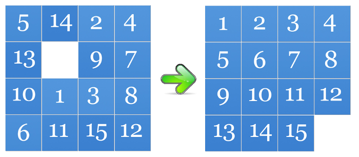
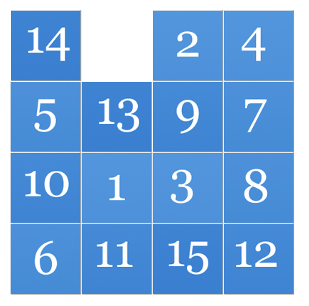

# Sliding Puzzle

**AI – Problem #48**

`http://www.microcontest.com/contest.php?id=48&lang=en`


## Description

For this challenge, a classic: the famous 15-Puzzle.

You are going to be given the puzzle in a shuffled state, and your goal will be
to find the moves leading to the solved state:



In order to represent a puzzle in a string, we use the following rules:

- Each case is represented by an integer, except for the empty case which is
  coded `X`
- The cases of a same line are separated by a `,`
- The lines are separated by a `;`

The puzzle to solve will be given in the variable `puzzle` with the convention
described above.

For example, the first puzzle of the picture would be:

```text
puzzle = "5,14,2,4;13,X,9,7;10,1,3,8;6,11,15,12"
```

You have to find the moves that solves the Puzzle. They can be:

- `U`: UP
- `D`: DOWN
- `L`: LEFT
- `R`: RIGHT

You have to return the series of moves in the variable `moves` by concatenating
the corresponding letters.

If we take the puzzle of the example, the string:

```text
moves = "RDL"
```

leads to this situation:



Of course, your moves must lead to the solved state.

One of the solutions of the example is:

```text
moves = "RULDRULDDRULDLLUDRULDRUULDRDLUURDDLURRRLLRLURRDLLRUURDLULDDRULUDRULLDRDLUURDDLUURRDLURRDLURDLLULDRRULDRRULLDRULLDRULDURRDLLURDRULDLURDLU"
```


## I/O

### Inputs

| Variable Name | Type   | C Type | Description                        |
| ------------- | ------ | ------ | ---------------------------------- |
| **puzzle**    | String | char*  | The string representing the puzzle |

### Outputs

| Variable Name | Type   | C Type | Description                                                               |
| ------------- | ------ | ------ | ------------------------------------------------------------------------- |
| **moves**     | String | char*  | The string representing the moves to perform in order to solve the puzzle |
