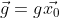
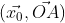
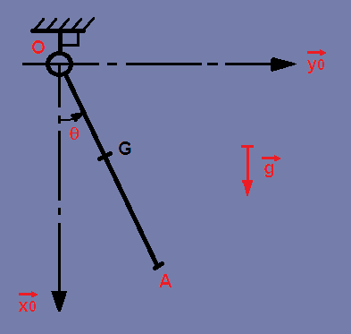
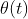
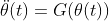
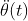
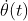

# Pendulum ODE I

**Physics – Problem #51**

`http://www.microcontest.com/contest.php?id=51&lang=en`


## Description

This challenge is the first of a series about resolution of nonlinear
differential equations.

A nonlinear differential equation is a nonlinear equation that relates some
function with its derivatives.

For this kind of equation, there are often no analytical solutions; hence,
numerical methods are required to solve these equations. These methods will be
the purpose of these challenges.

First, we want to consider a simple physical system which leads to a nonlinear
differential equation: the simple gravity pendulum.

We will model this system with a rigid bar `(OA)` with length `l` and no mass;
we will place a point mass `m` at the end `A` of the bar. Pivot
link in `O` is assumed to be perfect (frictionless). Gravity field is
.

We will use one relative parameter 
as the oriented angle .



We want to solve the equation of motion of this system, which is a nonlinear
differential equation. More precisely, as this equation of motion and the
function  and its derivatives have
only one independent variable (the time `t`), we have a particular kind of
equation named an Ordinary Differential Equation or **ODE**.

In order to see if numerical results are correct, first we want to find a way
to linearize our ODE. Hence we can have an analytical solution as a 'reference'.

So the goal of this challenge is to solve the equation of motion of the system,
with a small initial angle  (between 0°
and 1°). With the small-angle approximation we can define
 and
 that leads to linearize our
equation.

### Your job

Once you have determined the linearized equation of motion of the system (there
is a big amount of documentation about the subject on the internet), you will
have to solve it (using an analytical way) in order to find the solution in
terms of position of the problem (expression of the function
).

For your information, this differential equation is a second order equation,
meaning it includes a second derivative of the function
; and the form of this equation is
.

Then using derivations you will have to find the solution in terms of speed
(expression of the function ) and
acceleration (expression of the function
 of the problem.

In order to solve this challenge, you will get two variables that define
dimensions and initial conditions of the system:

- `l`: length of the bar in meters

- `theta_0`: initial angle  in degrees
  (between 0° and 1°)

- `g`: `9.81m/s^2`

- `m`: `5kg`

- :  `0°/s`
  (initial rotational speed)

You will have to send back the evaluations of
,
, and
 for
`t = [0, 10] seconds`.

Each value shall be truncated at 5 decimals. Hence, `4.56657946` will lead to
`4.56657`, `-56.254886` will lead to `-56.25488` and `0.12` will lead to
`0.12000`.

**Example**:

```text
l = 1.15

theta_0 = 0.75

theta = "-0.01277;0.01183;-0.01031;0.00830;-0.00588;0.00317;-0.00032;-0.00255;0.00530;-0.00779"

dtheta = "-0.00837;0.01634;-0.02352;0.02955;-0.03415;0.03708;-0.03822;0.03749;-0.03495;0.03070"

ddtheta = "0.10894;-0.10094;0.08802;-0.07083;0.05020;-0.02712;0.00273;0.02179;-0.04525;0.06652"
```


## I/O

### Inputs

| Variable Name | Type | C Type | Description                                                        |
| ------------- | ---- | ------ | ------------------------------------------------------------------ |
| **l**         | Real | float  | Bar length in meters                                               |
| **theta_0**   | Real | float  | Initial angle  in degrees |

### Outputs

| Variable Name | Type   | C Type | Description                                                                                         |
| ------------- | ------ | ------ | --------------------------------------------------------------------------------------------------- |
| **theta**     | String | char*  | Evaluations of the function  in radians                   |
| **dtheta**    | String | char*  | Evaluations of the function  in radians per second    |
| **ddtheta**   | String | char*  | Evaluations of the function  in radians per second^2 |
