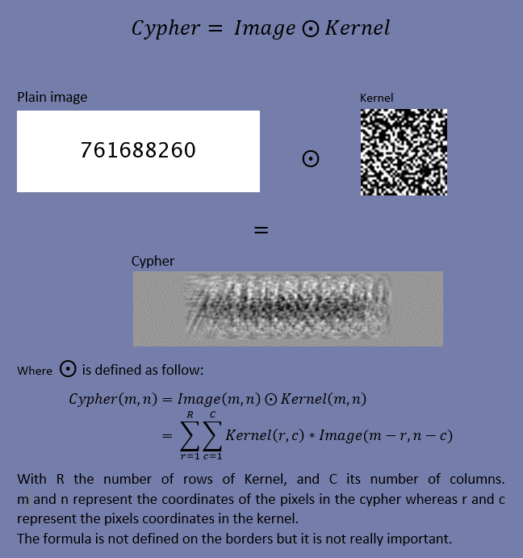

# Homemade Algorithm

**Cryptography – Problem #54**

`http://www.microcontest.com/contest.php?id=54&lang=en`


## Description

It is required to be able to solve the challenges Optical Character
Recognition I (`http://www.microcontest.com/contest.php?id=20`) and base64
(`http://www.microcontest.com/contest.php?id=50`) in order to solve this
challenge.

What we propose you in this challenge, is an "homemade algorithm" aimed at
enciphering an image. Of course, the method used and described here is far from
secured and would be a poor solution, but the point is in the mathematical
aspect of the problem.

Moreover, the algorithm modifies the image in a way that it is not possible to
read a text on it afterwards for example, but it does not completely change it.

The original image is simply a number written on an image with a white
background. The key of our encryption algorithm will be a 35x35 image (the
"kernel") with random pixel values. It will be given to you in the variable
`kernel`. A famous operation (yet mysterious) in signal or image processing is
used here to produce the "crypted" image (note that this operation is never used
in cryptography, it is aimed at completely different things)

Here is how it works:



You have to discover what this operation is, and find a way to retrieve the
original image from the cypher and the key. I advise you not to try to invert
the equation "by hand" yourself, it is just not possible ! Once you find the
name of this operation, the reverse technic is well documented.

Then, you have to recognize the number on the picture and send it back in the
variable `number`.

### Important information about the images

Since the kernel is composed by random values centered around zero, we give you
an image corresponding to the normalization of this kernel in order to be
viewable as an image with the full gray scale. Thus, you have to invert the
normalization before performing your calculations with this formula:

```
kernel_to_use = kernel*kernel_amplitude/255 + kernel_min
```

As you might have guessed, there is the same problem with the cypher. You have
to use the following formula to invert its normalization:

```
cypher_to_use = cypher*cypher_amplitude/255 + cypher_min
```


## I/O

### Inputs

| Variable Name        | Type   | C Type | Description                                             |
| -------------------- | ------ | ------ | ------------------------------------------------------- |
| **kernel**           | String | char*  | The key, which is the kernel, in PNG, encoded in base64 |
| **kernel_amplitude** | Real   | float  | Constant for the the provided formula                   |
| **kernel_min**       | Real   | float  | Constant for the the provided formula                   |
| **cypher**           | String | char*  | The cypher, in PNG, encoded in base64                   |
| **cypher_amplitude** | Real   | float  | Constant for the the provided formula                   |
| **cypher_min**       | Real   | float  | Constant for the the provided formula                   |

### Outputs

| Variable Name | Type    | C Type | Description                                   |
| ------------- | ------- | ------ | --------------------------------------------- |
| **number**    | Integer | int    | The number retrieved from the decrypted image |
