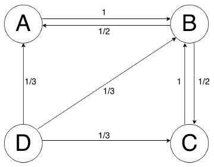
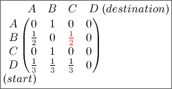
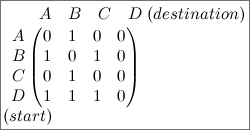

# Random Walk

**Mathematics – Problem #55**

`http://www.microcontest.com/contest.php?id=55&lang=en`


## Description

What will be discussed in this challenge made their designers rich and powerful.
Sounds interesting no? Let see what this is about.

We will consider the simpler version of the algorithm. Let us consider a graph
of cities with links between some of them:



Imagine now someone who decide to travel among cities randomly. At the beginning
he is in a city, and chose one of the possible links to go to a nearby town. All
links have the same probability to be chosen which is `1/N` with `N` the number
of links. For example, there are three links starting from `D` so the
probability for each link to be chosen is `1/3`. Once he arrives to the nearby
city he starts the process again. And this indefinitely.

Let's define now the best city the most visited by our traveler, the second best
the second most visited, etc. The purpose of this challenge is to establish the
rank of the cities.

In order to make the description of the graph simple, we describe it with a
matrix, called adjacency matrix, representing the probability to go from a city
to another. Here is an example with the previous graph:



For example, the red coefficient is the probability for the traveler when he is
in `B` to go to `C`.

But, to avoid approximations, we just simply put `1` where there is a link:



Then to recover the probability matrix, you just have to divide each row by the
number of `1`s in the row.

The matrix is coded in the same way as those of the Matrices challenge. For
example the above matrix would be coded:

```text
[[0,1,0,0][1,0,1,0][0,1,0,0][1,1,1,0]]
```

in the `links` variable.

The rank has to be sent back in `rank` variable with the following format when
cities are separated with comma, for example:

```text
3,4,1,2,5
```

Here the city `3` is the best and `5` is the worst. Use numbers (instead of
letters) from `1` to `n`, `n` standing for the dimension of the links matrix,
representing the number of cities.

You have not found what I was talking about in the beginning? I will give you a
hint: this algorithm is behind the success of Google when it started. And of
course, it is not applied to cities, but I am sure you have guessed what it is!


## Example

Let's take an example. For the following `links` variable value:
[links](./extra/example.txt)

We expect the following answer:

```
rank = "71,7,97,66,55,47,92,5,31,67,94,36,98,35,50,24,21,78,15,81,70,41,9,10,38,100,17,4,73,28,30,37,77,26,12,14,82,68,60,69,42,76,6,3,59,11,1,89,72,87,58,18,79,63,84,20,39,86,93,29,40,80,96,22,62,54,51,13,8,25,27,91,34,83,64,75,33,19,44,43,52,53,16,2,95,46,88,32,23,56,74,61,57,48,65,85,45,49,90,99"
```


## I/O

### Inputs

| Variable Name | Type   | C Type | Description  |
| ------------- | ------ | ------ | ------------ |
| **links**     | String | char*  | Links matrix |

### Outputs

| Variable Name | Type   | C Type | Description       |
| ------------- | ------ | ------ | ----------------- |
| **rank**      | String | char*  | Ranking of cities |
