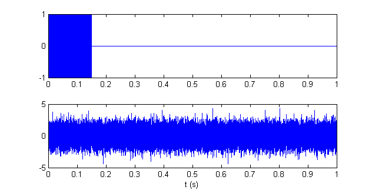

# Radar

**Physics – Problem #58**

`http://www.microcontest.com/contest.php?id=58&lang=en`

## Description

We will take a look here at how a radar works.

Basically, to determine the distance to an object, a signal is sent by the
radar, reflected on the object and captured again by the radar. The time `t`
taken by the signal to make the round-trip, knowing the speed of the signal `c`,
give the distance to the object `d = t*c/2`.

It actually sounds easy but in reality the received signal is drastically
attenuated and usually mixed with noise. Let's take an example:

The first plot is the emitted signal (the useful part lasts for 150 ms) and the
second one is the received signal on which you can only see the noise. Yet,
believe me, it do contains the reflected signal somewhere!

So you will have to determine the distance to the object with those two signals.
The emitted signal is given in the variable `tx` and the received signal in
`rx`. Each value is separated by a semicolon. Every signal lasts for one second
and the speed of the signal is 340 m/s (speed of sound). The distance has to be
sent back in the variable `distance` in meters.

## I/O

### Inputs

| Variable Name | Type   | C Type | Description     |
| ------------- | ------ | ------ | --------------- |
| **tx**        | String | char*  | Emitted signal  |
| **rx**        | String | char*  | Received signal |

### Outputs

| Variable Name | Type | C Type | Description            |
| ------------- | ---- | ------ | ---------------------- |
| **distance**  | Real | float  | Distance to the object |
